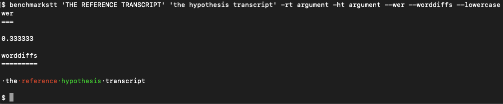

BenchmarkSTT
============

.. image:: https://img.shields.io/github/license/ebu/benchmarkstt.svg
    :target: https://github.com/ebu/benchmarkstt/blob/master/LICENCE.md

.. image:: https://img.shields.io/github/workflow/status/ebu/benchmarkstt/Python%20package
    :alt: GitHub Workflow Status (branch)
    :target: https://github.com/ebu/benchmarkstt/actions

.. image:: https://readthedocs.org/projects/benchmarkstt/badge/?version=latest
    :target: https://benchmarkstt.readthedocs.io/
    :alt: Documentation Status

About
------

This is a command line tool for benchmarking Automatic Speech Recognition engines.

It is designed for non-academic production environments, and prioritises ease of use and relative benchmarking over scientific procedure and high-accuracy absolute scoring.

Because of the wide range of languages, algorithms and audio characteristics, no single STT engine can be expected to excel in all circumstances. For this reason, this tool places responsibility on the users to design their own benchmarking procedure and to decide, based on the combination of test data and metrics, which engine is best suited for their particular use case.

Usage examples
--------------

Returns the number of word insertions, deletions, replacements and matches for the hypothesis transcript compared to the reference::

    benchmarkstt --reference reference.txt --hypothesis hypothesis.txt --diffcounts

Returns the Word Error Rate after lowercasing both reference and hypothesis. This normlization improves the accuracy of the Word Error Rate as it removes diffs that might otherwise be considered errors::

    benchmarkstt -r reference.txt -h hypothesis.txt --wer --lowercase

Returns a visual diff after applying all the normalization rules specified in the config file::

    benchmarkstt -r reference.txt -h hypothesis.txt --worddiffs --config conf

Further information
-------------------

This is a collaborative project to create a library for benchmarking AI/ML applications. It was created in response to the needs of broadcasters and providers of Access Services to media organisations, but anyone is welcome to contribute. The group behind this project is the EBU's `Media Information Management & AI group <https://tech.ebu.ch/groups/mim>`_.

Currently the group is focussing on Speech-to-Text, but it will consider creating benchmarking tools for other AI/ML services.

For general information about this project, including the `motivations <https://github.com/ebu/benchmarkstt/wiki>`_ and `guiding principles <https://github.com/ebu/benchmarkstt/wiki/Principles>`_, please see the project `wiki <https://github.com/ebu/benchmarkstt/wiki>`_

To install and start using the tool, go to the `documentation <https://benchmarkstt.readthedocs.io>`_.

