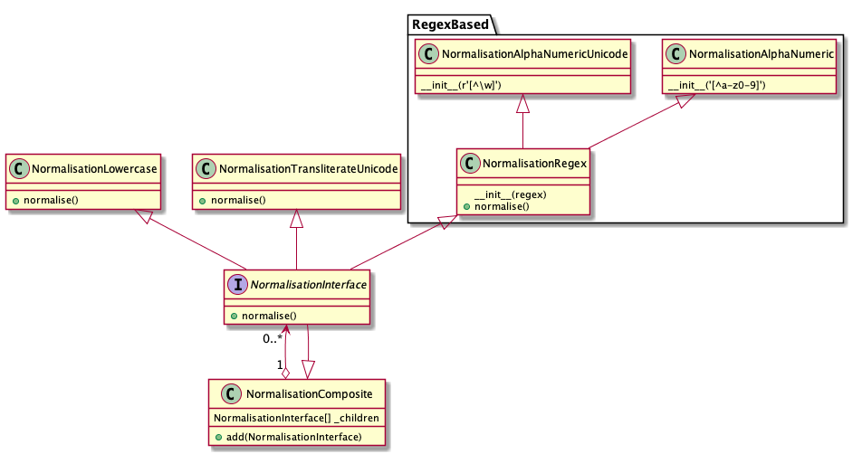

# Basic normalisation structure

* Status: proposed
* Deciders: all
* Date: 2019-01-23
* Original drafter(s): Mike De Smet (VIAA)

## Context and Problem Statement

How do we structure normalisation rules with support of multiple normalisation strategies, from general rules to possibly complex language specific normalisation rules as well as a combination of the normalisation rules?

## Decision Drivers 

* https://github.com/ebu/ai-benchmarking-stt/issues/5
* https://github.com/ebu/ai-benchmarking-stt/issues/7
* https://github.com/ebu/ai-benchmarking-stt/issues/8

## Proposal

Use a Composite object to encompass various normalisation strategies. The used strategies can then be added, tweaked, copied and combined as wanted. The combination of strategies can be tweaked per use-case and/or language.

### Diagram

(includes some example simple normalisation classes that may be used)

### Pros
* Separation of different strategies makes for better readability and reduces apparent complexity (each normalizer can be fully documented) 
* Highly extensible and re-usable (building up complexity out of small, less complex, blocks is still possible)
* Easy comparative testing between strategies (fast prototyping and testing of solutions)
* Support specific cases as well as generic cases out-of-the-box
* Adheres to our principles, mainly "annotation over documentation", "transparency" and "pragmatism"
* Each strategy can be easily unit tested separate from all others

